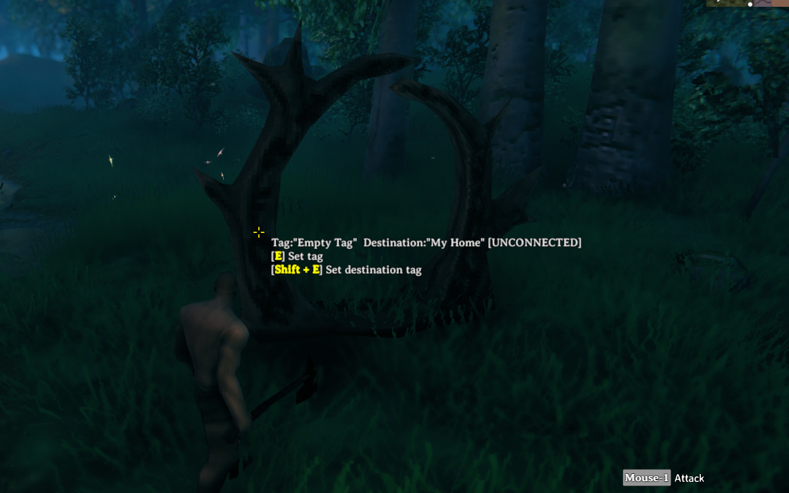

# Better Portal - Valheim Mod

Better Portal is a mod that allows you to change the destination of portals to any tag. I know that there are already mods with the same functionality, but I created this mod because I did not want to install Jotunn. If you already have Jotunn installed, there is no advantage to using this mod. This mod has only minimal functionality.

> **IMPORTANT**
>
> This mod has been developed by an individual and is not associated with the game's developer in any way. Please refrain from asking the developer any questions regarding this mod.

## Features

For practical usage notes, see [docs/user-guide.md](docs/user-guide.md).

When interacting with a portal, hold the configured modifier key to set the destination tag. Portals do not have to be connected to each other and can teleport one way.

> **TIP**: Pressing the Insert key while entering the destination tag autocompletes from existing portal tags. Pressing the Up Arrow or Down Arrow key rotates existing tags.

> **NOTE**: If multiple portals have the specified destination tag, the connection target is selected randomly.

## Configurations

I recommend using [Configuration Manager](https://github.com/BepInEx/BepInEx.ConfigurationManager).

Use [CONFIG.md](CONFIG.md) for every configuration entry and default value. Use [docs/user-guide.md](docs/user-guide.md) for workflow notes.

## Languages

| Language | Translators | Status |
| --- | --- | --- |
| English | Translation Tools | 100% |
| German | FreeFun | 100% |
| Japanese | EideeHi | 100% |

## Contacts

[Open an issue](https://github.com/eideehi/valheim-better-portal/issues) for bug reports.

## Credits

- **Dependencies**:
  - [LitJSON](https://litjson.net)
- **Contributors**:
  - [Fusionette](https://github.com/Fusionette)
  - [FreeFun](https://github.com/xXFreeFunXx)

## License

Better Portal is developed and released under the MIT license. For the full text of the license, please see the [LICENSE](LICENSE) file.
